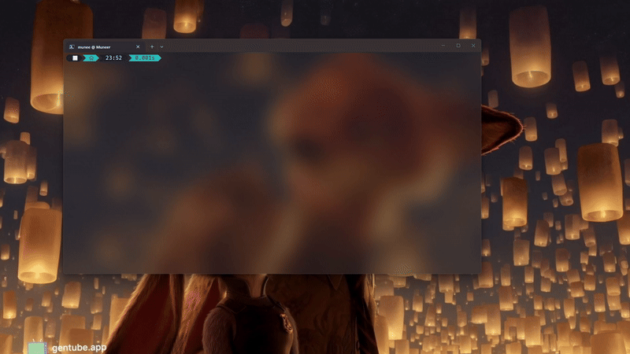

# Safedump

<p align="center">
  
</p>

<p align="center">
  <strong>Debug crashes without reproducing them.</strong><br>
  <em>Local-first crash reports with automatic secret redaction.</em>
</p>

<p align="center">
  <a href="https://pypi.org/project/safedump/"></a>
  <a href="https://github.com/Muneer320/safedump/releases"></a>
  <a href="https://github.com/Muneer320/safedump/actions/workflows/ci.yml"></a>
  <a href="https://pypi.org/project/safedump/"></a>
  <a href="https://pypi.org/project/safedump/"></a>
  <a href="LICENSE"></a>
  <a href="https://reuse.software/"></a>
</p>

---

## What is Safedump?

Python's traceback tells you **where** your code crashed. Safedump tells you **why**.

When an exception occurs, Safedump captures the complete debugging context — local variables, exception chains, thread state, environment — and saves it as a structured, safe-to-share crash report. No cloud. No telemetry. No network calls. Ever.

```python
import safedump

safedump.install()
# ... your application runs, crashes ...
# Crash report saved: ~/.safedump/crash-2026-06-25-123456-TypeError-a1b2c3.safedump.json
```

Then inspect it anytime:

```bash
safedump view              # Terminal (Rich)
safedump view --html       # Self-contained HTML file
safedump serve             # Local web browser UI
```

## Why Safedump?

| Problem | Without Safedump | With Safedump |
|---|---|---|
| "It crashed on the server" | Ask user for logs, try to reproduce | Open the crash report file |
| "What were the variable values?" | Add print() statements, redeploy | Already captured in the report |
| "Can I share this crash safely?" | Manually audit for secrets first | Automatic redaction built in |
| "Which thread crashed?" | Guess from log timestamps | Thread state captured at crash time |
| "Works on my machine" | SSH in, check environment | Environment metadata in every report |

## Quick Start

### Installation

```bash
pip install safedump[view]    # with Rich terminal viewer
pip install safedump           # minimal (no dependencies)
```

### One-line setup

```python
import safedump

safedump.install()
```

That's it. Every unhandled exception now produces a crash report.

### Manual capture

```python
try:
    result = dangerous_operation()
except Exception:
    path = safedump.capture_exception()
    print(f"Crash captured: {path}")
    raise
```

## Features

### 🔒 Privacy First
- **Zero cloud** — no network calls, no telemetry, no accounts
- **Secret redaction** — denylist (variable names) + regex (credentials) + entropy-based detection
- **Privacy tiers** — configure exactly what gets captured (levels 0-4)
- **File permissions** — reports saved with `0600` (owner-only)

### 📋 Rich Debugging Context
- **Local variables** — values and types at every stack frame
- **Exception chains** — full `__cause__` + `ExceptionGroup` support
- **Thread state** — all threads captured, crashing thread highlighted
- **Environment** — OS, Python version, CWD, env var names

### 🎨 Developer Experience
- **One-line install** — `import safedump; safedump.install()`
- **Beautiful terminal viewer** — Rich-powered with syntax highlighting
- **Self-contained HTML export** — `safedump view --html report.html`
- **Local web server** — `safedump serve` for browsing reports in the browser
- **CLI filtering** — `safedump list --type KeyError --since 7d --search error`
- **Crash statistics** — `safedump stats` for aggregate data
- **Diagnostics** — `safedump doctor` checks configuration integrity
- **Config presets** — `configure(preset="production")`

### 🔧 Extensible
- **Custom serialization** — `register_serializer()` for non-standard types
- **Custom redaction** — `RedactionRule` for domain-specific scrubbing
- **`before_capture` hook** — pre-processing before report generation
- **`on_crash` hook** — callback invoked after each capture (file notification, etc.)
- **pytest integration** — auto-capture on test failures
- **Click/Typer integration** — `@wrap_click()` decorator

## CLI Reference

```bash
safedump view [file]              # View crash report (Rich terminal)
safedump view --json [file]        # View as raw JSON
safedump view --html [output]      # Export as self-contained HTML
safedump list [--count] [--type] [--since] [--search]
safedump stats                     # Aggregate crash statistics
safedump doctor [--verbose]        # Diagnose common issues
safedump serve [--port] [--host]   # Start local web server
safedump clean --older-than DAYS   # Delete old reports
safedump test                      # Verify installation
```

## Configuration

```python
safedump.configure(
    preset="production",  # "development", "debug", "minimal"
    output_dir="./crashes",
    privacy_tier=1,  # 0=minimal, 1=default, 4=everything
    enable_entropy_detection=True,  # Shannon entropy-based secret detection
    compress=True,  # Gzip compressed crash reports
    on_crash=my_notification_handler,  # Callback after each capture
)
```

## Documentation

Full documentation at **[safedump.dev](https://Muneer320.github.io/safedump)** (coming with v2.0).

## Supported Platforms

| Platform | Status | Notes |
|---|---|---|
| Linux | ✅ | Primary development platform |
| macOS | ✅ | Fully supported |
| Windows | ✅ | Verified on Windows 11, Python 3.13 |

**Python versions:** 3.9 through 3.13.

## Contributing

Contributions are welcome! See [CONTRIBUTING.md](CONTRIBUTING.md) for development setup and guidelines.

**Looking for a place to start?** Check out [open issues](https://github.com/Muneer320/safedump/issues) with the `good first issue` label.

## License

MIT &copy; [Muneer Alam](https://github.com/Muneer320)
